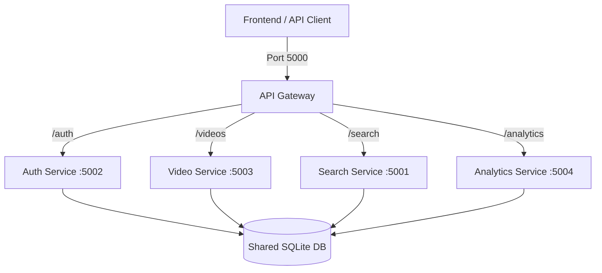
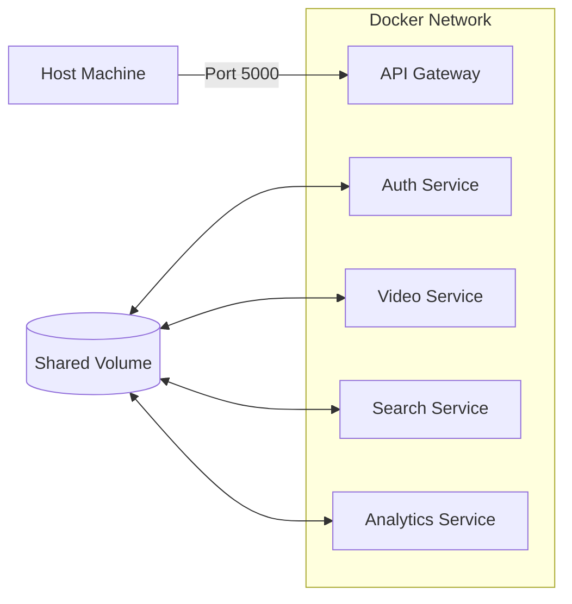
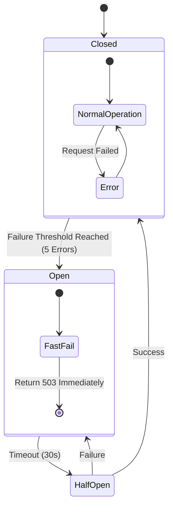

# Microservices Video Platform

A scalable, microservices-based video platform built with Python (Flask), utilizing an API Gateway pattern to orchestrate authentication, video management, search, and analytics.

## System Architecture

The system follows a **Microservices Architecture** where a central **API Gateway** routes all client requests to the appropriate downstream services.

### Architecture Diagram


### Key Components
- **API Gateway (Port 5000)**: Single entry point. Handles routing, CORS, and request forwarding.
- **Auth Service (Port 5002)**: Manages user registration, login, and JWT generation.
- **Video Service (Port 5003)**: Handles video CRUD operations.
- **Search Service (Port 5001)**: Asynchronous search using a Job Queue pattern.
- **Analytics Service (Port 5004)**: Provides usage statistics and insights.
- **Shared Database**: A single SQLite instance accessed by all services (for simplicity in this dev environment).

---

## Docker Infrastructure

The platform is fully containerized using Docker and Docker Compose.

### Docker Architecture


### Running with Docker
1.  **Build and Start**:
    ```bash
    docker-compose up --build
    ```
2.  **Access**:
    - Frontend/API: `http://localhost:5000`
    - Services communicate internally via DNS (e.g., `http://auth-service:5002`).

---

## Resilience: Circuit Breaker

To prevent cascading failures, the API Gateway implements the **Circuit Breaker** pattern.

### Logic Diagram


### Behavior
- **Closed State**: Requests flow normally. Failures are counted.
- **Open State**: After 5 consecutive failures, the circuit opens. All requests fail immediately with a 503 error to protect the downstream service.
- **Half-Open State**: After 30 seconds, one request is allowed through. If it succeeds, the circuit closes. If it fails, it re-opens.

---

## Service Map

| Service | Port | Base Route | Responsibilities |
| :--- | :--- | :--- | :--- |
| **API Gateway** | `5000` | `/api/v1/*` | Routing, CORS, Circuit Breaker |
| **Search Service** | `5001` | `/api/v1/search` | Async Search Jobs, Polling Results |
| **Auth Service** | `5002` | `/api/v1/auth` | Register, Login, Token Mgmt |
| **Video Service** | `5003` | `/api/v1/videos` | Create, Read, Update, Delete Videos |
| **Analytics Service** | `5004` | `/api/v1/analytics` | Dashboard Data, Usage Stats |

---

## Setup Instructions (Local Dev)

### Prerequisites
- Python 3.8+
- Node.js 14+ (for Frontend)
- PowerShell (for testing script)

### 1. Environment Configuration
Each service requires specific environment variables. Ensure your `.env` files or system environment variables are set.

**Common Variables:**
```bash
# Shared Database Path (Absolute path recommended)
DATABASE_URL=sqlite:///C:/path/to/shared/database.db

# Service URLs (Used by Gateway)
AUTH_SERVICE_URL=http://localhost:5002
VIDEO_SERVICE_URL=http://localhost:5003
SEARCH_SERVICE_URL=http://localhost:5001
ANALYTICS_SERVICE_URL=http://localhost:5004

# Security
JWT_SECRET=my_shared_secret_123
```

### 2. Running the Services
You need to run each service in a separate terminal.

**API Gateway:**
```bash
cd microservices-version/api-gateway
python app.py
```

**Auth Service:**
```bash
cd microservices-version/auth-service
python app.py
```

**Video Service:**
```bash
cd microservices-version/video-service
python app.py
```

**Search Service:**
```bash
cd microservices-version/search-service
python app.py
```

**Analytics Service:**
```bash
cd microservices-version/analytics-service
python app.py
```

---

## Integration Testing

We provide a PowerShell script to verify the "Golden Path" of the application: **Register -> Create Video -> Async Search -> Poll Results**.

### Running the Test
```powershell
./test_microservices.ps1
```

### What it Tests
1.  **Health Check**: Verifies the Gateway is online.
2.  **Registration**: Creates a new user via Auth Service.
3.  **Data Creation**: Posts a video via Video Service.
4.  **Async Search**: Submits a search job to Search Service.
5.  **Polling**: Polls the job status until completion.
6.  **Validation**: Ensures the search result matches the created video.

---

## Frontend Integration

The frontend should **ONLY** communicate with the API Gateway.

### Configuration
In your frontend `.env.local`:
```bash
NEXT_PUBLIC_API_URL=http://localhost:5000
```

### API Client Example
```javascript
// Correct: Point to Gateway
const apiClient = axios.create({
  baseURL: 'http://localhost:5000/api/v1',
  headers: { Authorization: `Bearer ${token}` }
});

// Incorrect: Pointing directly to services
// const videoClient = axios.create({ baseURL: 'http://localhost:5003' });
```

---

## Troubleshooting Guide

### 1. `WinError 10061` / Service Offline
**Symptom**: The test script or frontend fails with "Connection refused".
**Fix**:
- Ensure **ALL** 5 python processes (Gateway + 4 Services) are running.
- Check if the ports (5000-5004) are already in use by another application.

### 2. "Video service unavailable" (503 Error)
**Symptom**: Gateway returns 503 when accessing video routes.
**Fix**:
- Verify `VIDEO_SERVICE_URL` in the Gateway's `.env` matches the actual port the Video Service is running on.
- Ensure the Video Service is not crashing on startup.
- **Circuit Breaker**: If the service failed multiple times, wait 30 seconds for the breaker to reset.

### 3. SQLAlchemy Configuration Errors
**Symptom**: "no such table" or database lock errors.
**Fix**:
- Ensure all services are pointing to the **EXACT SAME** `database.db` file.
- Use an absolute path for `DATABASE_URL` to avoid relative path confusion between services.
- Example: `sqlite:///C:/Users/DELL/Project/shared/database.db`

### 4. Search Returns No Results
**Symptom**: Test script says "COMMUNICATION OK, BUT NO RESULTS".
**Fix**:
- The Search Service might be checking the database before the Video Service has committed the transaction.
- Ensure the shared database file is accessible by both services.
